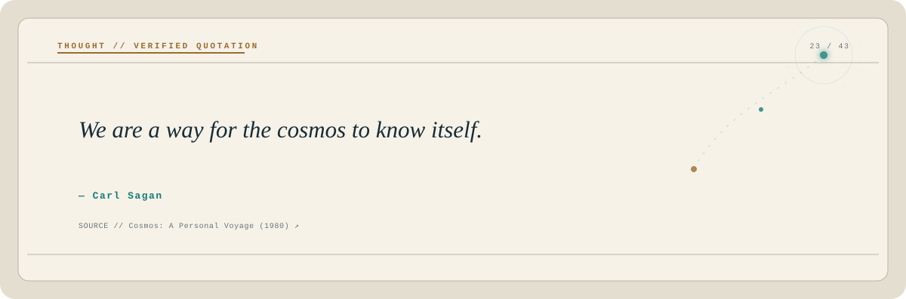

<!-- protocol: 2608 -->

  <picture>
    <source media="(prefers-color-scheme: dark)" srcset="assets/system-dark.svg">
    <source media="(prefers-color-scheme: light)" srcset="assets/system-light.svg">
    
  </picture>

 

<picture>
  <source media="(prefers-color-scheme: dark)" srcset="assets/thought-dark.svg">
  <source media="(prefers-color-scheme: light)" srcset="assets/thought-light.svg">
  
</picture>

  
<code>sudo reveal_more</code>

   

  <pre>
access granted.

research_policy   follow the interesting question
known_issue       one answer may open seven new tabs
preferred_tools   first principles, evidence, unreasonable curiosity
exit_condition    understanding &gt; appearance of understanding
optimization      systems... including myself
discipline        non-negotiable
  </pre>

  A living README. Thoughts rotate automatically; provenance lives in <code>data/thoughts.json</code>.

